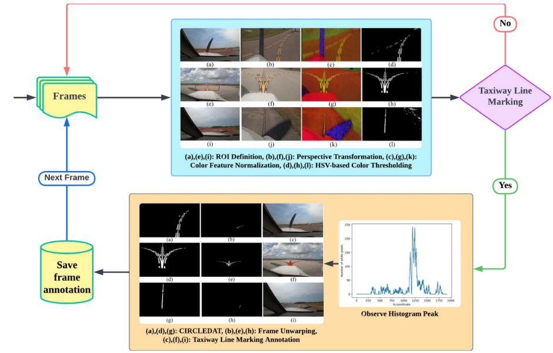

# ALINA: Advanced Line Identification and Notation Algorithm

<p align="center">
  <a href="https://arxiv.org/abs/2406.08775" target="_blank" rel="noopener noreferrer">Paper</a> | <a href="https://khanhafeez.github.io/alina-project-page/" target="_blank" rel="noopener noreferrer">Website</a> | <a href="[https://khanhafeez.github.io/alina-project-page/](https://drive.google.com/file/d/1PRiW-VAJYTePNzT9zAQ2bZFvNlt-OIfU/view?usp=sharing)" target="_blank" rel="noopener noreferrer">CVPR 2024 Presentation</a>
</p>

Official implementation of *ALINA: Advanced Line Identification and Notation Algorithm* [1], accepted to the CVPR 2024 Workshop on Vision Datasets Understanding (VDU).

<p align="center">
  
</p>

## 📦 What's in this Repo

**Core pipeline (`alina/`)**

- Interactive ROI selection, drawn once and reused across an entire video's frames
- Perspective warp of the ROI into a bird's-eye view
- HSV color feature normalization + color thresholding
- Histogram-based peak detection to locate candidate line markings
- CIRCLEDAT: the traversal algorithm that isolates line-marking pixels
- Frame unwarping, annotation, and coordinate file output
- Data prep utilities: video → frames, frame rotation, batch resizing

**Evaluation (`eval/`)**

- `cbem`, an interactive tool to hand-create ground truth (context-based edge maps, CBEM)
- `evaluate`, batch precision / recall / F1 against that ground truth
- `superimpose`, a visual check overlaying detected coordinates on a Canny edge map

**Sample data (`data/`)**

| Folder | Contents |
|---|---|
| `Raw_Data/vidd_1`, `vidd_2`, `vidd_3` | Raw extracted frames from 3 taxiway videos |
| `Labeled_Data/vidd_*/annotations/` | Sample ALINA output — labeled frames |
| `Labeled_Data/vidd_*/textfiles/` | Sample ALINA output — matching coordinate `.txt` files |
| `gt_alina_labels/canny_textfiles/` | Hand-created CBEM ground-truth coordinates, 3 subsets |
| `gt_alina_labels/canny_images/` | CBEM edge-map images (visual reference for the above) |
| `gt_alina_labels/ALINA_textfiles/` | ALINA's own output on those same ground-truth frames, for direct comparison |

## Repository structure

```
alina/
  config.py       # PipelineConfig / ROIConfig — all tunables in one place
  roi.py          # interactive ROI selection (+ display-scaling for large frames)
  color.py        # HSV color feature normalization
  histogram.py    # vertical projection / peak detection
  traversal.py    # CIRCLEDAT: circular threshold pixel discovery and traversal
  pipeline.py     # process_image() / run_batch() — the main labeling loop
  io_utils.py     # video -> frames, frame rotation, batch resize

eval/
  metrics.py      # precision / recall / F1
  cbem.py         # interactive tool to hand-create ground truth (CBEM)
  evaluate.py     # batch precision/recall/F1 vs. ground truth
  superimpose.py  # visual check: overlay coordinates on a Canny edge map

cli.py            # `alina <subcommand>` entry point
pyproject.toml    # pip install -e .
requirements.txt

data/
  Raw_Data/            # raw extracted video frames (vidd_1, vidd_2, vidd_3)
  Labeled_Data/         # sample ALINA output: annotations/ (images) + textfiles/ (coords)
  gt_alina_labels/      # ground truth used for evaluation
    canny_textfiles/       # CBEM coordinate files (hand-created ground truth)
    canny_images/          # CBEM edge-map images (visual reference)
    ALINA_textfiles/       # ALINA's own output on those same ground-truth frames
```

## Setup

Works with Python 3.9+ (tested with 3.10.12).

```bash
git clone <this-repo>
cd ALINA
python3 -m venv venv
source venv/bin/activate        # Windows: venv\Scripts\activate
pip install -e .
```

This installs `numpy`, `opencv-python`, `matplotlib`, and puts an `alina` command on your PATH (inside the venv). Verify with:

```bash
alina --help
```

Every command below also has an alternative `python cli.py ...`, run from the repo root.

## Running the pipeline

### `alina label` (batch)

Labels every frame in a folder using one ROI, drawn once on the first frame and reused for the rest. Use this for the normal end-to-end workflow: point it at a folder of raw frames from one video, and it labels all of them in one run.

```bash
alina label \
  --input-dir data/Raw_Data/vidd_1 \
  --output-images-dir outputs/vidd_1/annotated \
  --output-coords-dir outputs/vidd_1/coords \
  --log-file outputs/vidd_1/timing.log
```
```bash
python cli.py label \
  --input-dir data/Raw_Data/vidd_1 \
  --output-images-dir outputs/vidd_1/annotated \
  --output-coords-dir outputs/vidd_1/coords \
  --log-file outputs/vidd_1/timing.log
```

| Arg | Default | Meaning |
|---|---|---|
| `--input-dir` | – | Folder of `.jpg` frames to label |
| `--output-images-dir` | – | Where annotated frames are written |
| `--output-coords-dir` | – | Where per-frame coordinate `.txt` files are written |
| `--log-file` | – | Also write the per-frame log + summary to this file |
| `--peak-threshold` | `50` | Min histogram peak height to attempt line extraction |
| `--circular-threshold` | `15` | CIRCLEDAT neighborhood radius (pixels) |
| `--min-white-pixels` | `200` | Min white pixels in the peak column to trust it |
| `--yellow-lower` | `0 70 170` | Lower HSV bound for the color mask (H S V) |
| `--yellow-upper` | `255 255 255` | Upper HSV bound for the color mask (H S V) |
| `--mask-ignore-left-columns` | `300` | Zero out this many mask columns from the left before traversal |

You'll be shown the first frame and asked to click the ROI: **Bottom-Left, Top-Left, Top-Right, Bottom-Right**, in that order, then press any key. You'll then see a preview of the finalized ROI drawn on the reference frame: press any key to start the batch if it looks right, or `Ctrl+C` and re-run the command to redo the ROI if not. The selected ROI is applied to every frame in the folder.

Note: Frames larger than 1080px on their longest side are shown at a scaled-down size so the window fits your screen, and clicks are mapped back to full-resolution coordinates automatically.

### `alina label --image` (single frame)

You may use this command on one image from the dataset to tune parameters (`--peak-threshold`, `--circular-threshold`, `--min-white-pixels`, `--yellow-lower`/`--yellow-upper`, `--mask-ignore-left-columns`) before committing to a full batch.

```bash
alina label \
  --image data/Raw_Data/vidd_1/00001.jpg \
  --output-images-dir outputs/debug \
  --output-coords-dir outputs/debug \
  --show
```
```bash
python cli.py label \
  --image data/Raw_Data/vidd_1/00001.jpg \
  --output-images-dir outputs/debug \
  --output-coords-dir outputs/debug \
  --show
```

| Arg | Default | Meaning |
|---|---|---|
| `--image` | – | Process a single image instead of a whole `--input-dir` |
| `--show` | off | Display the annotated result window |

### `alina video-to-frames`

Extracts every frame of a video file into a folder of numbered `.jpg` images. Use this first, before labeling, if you're starting from a raw video instead of already-extracted frames.

```bash
alina video-to-frames --video raw/taxiway.mp4 --output-dir data/Raw_Data/vidd_4
```
```bash
python cli.py video-to-frames --video raw/taxiway.mp4 --output-dir data/Raw_Data/vidd_4
```

### `alina rotate-frames`

Rotates every frame in a folder by a fixed angle. Use this if a video was recorded with the camera mounted upside-down or sideways, before running `label` on it.

```bash
alina rotate-frames --input-dir data/Raw_Data/vidd_4 --output-dir outputs/rotated --angle 180
```
```bash
python cli.py rotate-frames --input-dir data/Raw_Data/vidd_4 --output-dir outputs/rotated --angle 180
```

| Arg | Default | Meaning |
|---|---|---|
| `--angle` | `180` | `90`, `180`, or `270` |

### `alina resize-images`

Resizes all frames in a folder to a fixed resolution.

```bash
alina resize-images --input-dir data/Raw_Data/vidd_4 --output-dir outputs/resized --width 1920 --height 1080
```
```bash
python cli.py resize-images --input-dir data/Raw_Data/vidd_4 --output-dir outputs/resized --width 1920 --height 1080
```

| Arg | Default | Meaning |
|---|---|---|
| `--width` / `--height` | `1920` / `1080` | Target resolution |

### `alina cbem` (create ground truth)

You can hand-trace a line marking on one frame and run Canny edge detection inside that traced region to produce ground-truth coordinates. Use this to build (or add to) a ground-truth set before running `evaluate` — it's how the `gt_alina_labels/canny_*` data in this repo was created.

```bash
alina cbem --image data/Raw_Data/vidd_1/00001.jpg --output-dir outputs/cbem
```
```bash
python cli.py cbem --image data/Raw_Data/vidd_1/00001.jpg --output-dir outputs/cbem
```

Click and drag to trace an outline around a visible line marking, press **`s`** to run Canny edge detection inside the traced region and save it, or **`Esc`** to close. Multiple regions can be traced and saved from the same frame.

### `alina evaluate`

Computes precision, recall, and F1 by comparing ALINA's coordinate output against ground-truth (CBEM) coordinate files. Use this after you have both a ground-truth set (from `cbem`) and ALINA's output (from `label`) for the same frames, to measure how accurate the labeling was.

```bash
alina evaluate \
  --canny-dirs data/gt_alina_labels/canny_textfiles/canny_textfiles_1 data/gt_alina_labels/canny_textfiles/canny_textfiles_2 data/gt_alina_labels/canny_textfiles/canny_textfiles_3 \
  --alina-dirs data/gt_alina_labels/ALINA_textfiles/ALINA_textfiles_1 data/gt_alina_labels/ALINA_textfiles/ALINA_textfiles_2 data/gt_alina_labels/ALINA_textfiles/ALINA_textfiles_3
```
```bash
python cli.py evaluate \
  --canny-dirs data/gt_alina_labels/canny_textfiles/canny_textfiles_1 data/gt_alina_labels/canny_textfiles/canny_textfiles_2 data/gt_alina_labels/canny_textfiles/canny_textfiles_3 \
  --alina-dirs data/gt_alina_labels/ALINA_textfiles/ALINA_textfiles_1 data/gt_alina_labels/ALINA_textfiles/ALINA_textfiles_2 data/gt_alina_labels/ALINA_textfiles/ALINA_textfiles_3
```

Prints average recall, precision, and F1 across all matched frame pairs. `--canny-dirs`/`--alina-dirs` are paired by position.

### `alina superimpose`

Draws a given coordinate file's points on top of a Canny edge map of the same frame, so you can visually confirm the detected pixels superimpose the line marking.

```bash
alina superimpose \
  --image data/Raw_Data/vidd_1/00001.jpg \
  --coords outputs/vidd_1/coords/00001.txt \
  --output-dir outputs/superimpose_check
```
```bash
python cli.py superimpose \
  --image data/Raw_Data/vidd_1/00001.jpg \
  --coords outputs/vidd_1/coords/00001.txt \
  --output-dir outputs/superimpose_check
```

`--output-dir` is optional; omit it to just view the windows without saving.

## Benchmark results

**ALINA vs. CDLEM** [2], evaluated against a 120-frame CBEM ground-truth set:

| Algorithm | Detection Rate (%) | Processing Time (ms) |
|---|---|---|
| CDLEM | 91.14 | 120.35 |
| **ALINA** | **98.45** | **50.09** |

**CIRCLEDAT vs. sliding-window search** [3], for isolating line-marking pixels:

| Algorithm | Time Complexity | Processing Time (ms) |
|---|---|---|
| Sliding Window | O(m × n) | 10.90 |
| **CIRCLEDAT** | **O(k)** | **3.33** |

## References

[1] Khan, M. A. H., Ganeriwala, P., Bhattacharyya, S., Neogi, N., & Muthalagu, R. (2024, June). Alina: Advanced line identification and notation algorithm. In 2024 IEEE/CVF Conference on Computer Vision and Pattern Recognition Workshops (CVPRW) (pp. 7293-7302). IEEE.

[2] Ganeriwala, P., Bhattacharyya, S., Gunther, S., Kish, B., Khan, M. A. H., Dhadoti, A., & Neogi, N. (2023, December). Assisttaxi: A comprehensive dataset for taxiway analysis and autonomous operations. In 2023 International Conference on Machine Learning and Applications (ICMLA) (pp. 1094-1099). IEEE.

[3] Muthalagu, R., Bolimera, A., & Kalaichelvi, V. (2020). Lane detection technique based on perspective transformation and histogram analysis for self-driving cars. Computers & Electrical Engineering, 85, 106653.

```bibtex
@inproceedings{khan2024alina,
  title={Alina: Advanced line identification and notation algorithm},
  author={Khan, Mohammed Abdul Hafeez and Ganeriwala, Parth and Bhattacharyya, Siddhartha and Neogi, Natasha and Muthalagu, Raja},
  booktitle={2024 IEEE/CVF Conference on Computer Vision and Pattern Recognition Workshops (CVPRW)},
  pages={7293--7302},
  year={2024},
  organization={IEEE}
}
```

## Acknowledgement

This work is built with [OpenCV](https://opencv.org/), [NumPy](https://numpy.org/), and [Matplotlib](https://matplotlib.org/), and evaluated on the AssistTaxi dataset [2]. We thank the authors of these projects for making them available to the community.
